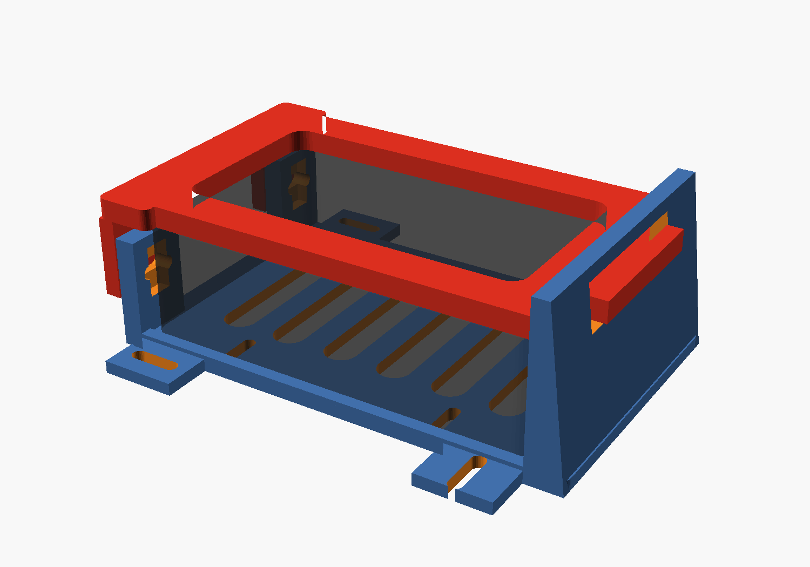
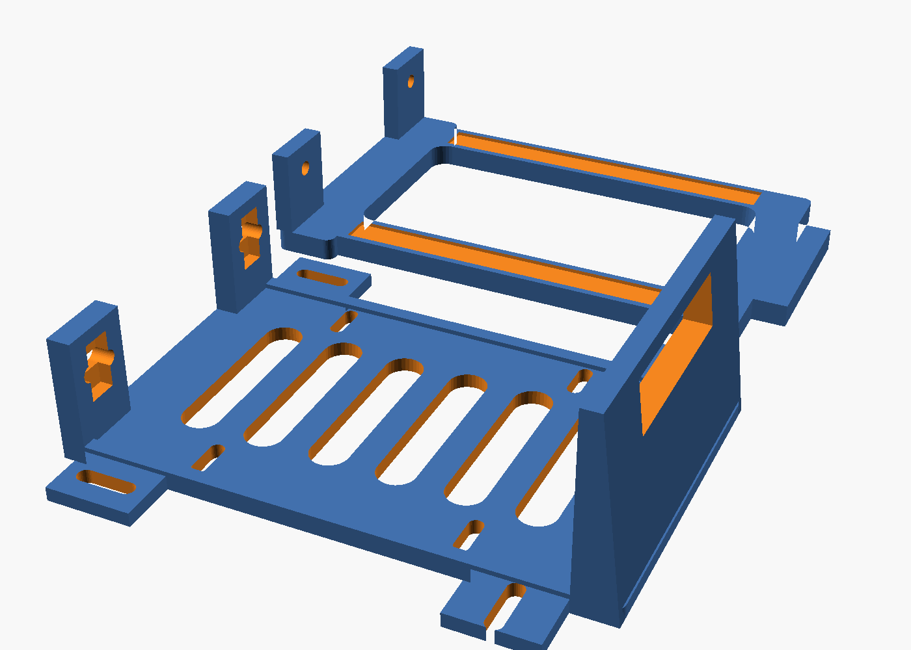

# Raspberry Pi 5 Shelf — clamp-on redesign



The Pi 5 now lives inside a closed case, which puts its four M2.5 board holes
out of reach — the old "bolt the bare board to a deck" shelf can't be used any
more. This version grips the **case** instead: it drops into a shallow tray and
a removable yoke clamps down across the top of it. Nothing screws into the Pi,
and the Pi comes out in about ten seconds without unbolting the shelf from the
chassis.

Everything is generated from one parametric source, [`pi_shelf.scad`](pi_shelf.scad).

## Measure your case first

**The three numbers at the top of the `.scad` file are the whole design.** The
committed STLs are built for a generic slim Pi 5 ABS case; if yours differs by
more than a couple of millimetres in X or Y, re-render before printing.

| Parameter | Value | Status | What to measure |
|-----------|-------|--------|-----------------|
| `case_l` | 96 mm | **estimate** | Long axis — the two faces carrying the ports run along this |
| `case_w` | 61.9 mm | measured | Short axis |
| `case_h` | 30 mm | **estimate** | Total height, rubber feet to lid |
| `fit` | 0.6 mm | — | Clearance per side. Bump to 0.8 for an easier drop-in |

Measure over the *widest* point: lid overhang, feet, heatsink fins and all.
Height is the forgiving one — the clamp has ±3 mm of travel built in, so
anything within `case_h ± 3` works off the same print. Length and width are
not forgiving; the tray is a pocket.

**`case_l` and `case_h` are still guesses — measure them before you print.**
Height is the forgiving one; length is not.

Two more dimensions deserve a second look:

- **`curb_h` (4 mm)** — the side curbs. Both long faces of a Pi 5 carry ports
  (USB-A ×4 + Ethernet on one, USB-C + micro-HDMI on the other), so nothing may
  rise in front of them. The curbs stop well below the lowest port cutout on
  the case and locate it sideways; the yoke does the holding down. If your case
  has a cutout that starts lower than 4 mm off its base, drop this number.
- **`tongue_w_set` (0 = auto)** — the rear tongue auto-fits the rear cross
  member that carries it, so it tracks `case_w` on its own. Set a number only
  if you want to override it.

## How it holds the case

| Direction | What stops it |
|-----------|---------------|
| +X | rear wall |
| −X | the two front towers |
| ±Y | side curbs |
| +Z | the yoke |

The yoke's rear tongue slides into a slot in the rear wall; its two front legs
straddle the outside of the towers. Each tower has a vertical slot backed by a
**sliding nut channel** recessed flush into its inner face, so an M3 nut can
neither spin nor foul the case. Tightening the two screws pulls the yoke down
onto the case top at whatever height it happens to need — that's where the
±3 mm of tolerance comes from.

The middle of the yoke is open, so the case's top stays accessible: airflow,
GPIO ribbon, and the CSI ribbon to the Camera Module 3 all come straight out
without removing anything.

## Printing



| Setting | Value |
|---------|-------|
| Material | PETG preferred, PLA fine | 
| Layer height | 0.2 mm |
| Walls | 3 perimeters |
| Infill | 30% |
| Supports | **None needed** — both parts are support-free in the orientations below |
| Footprint | base 111 × 93 mm, yoke 115 × 69 mm |

Both parts fit one A1 Mini plate: `stl/plate.stl` is 116 × 168 mm, about 6 mm
of margin per side. If you end up with a longer case, that margin goes into the
X axis first — check it against the bed before slicing, or print `base.stl` and
`yoke.stl` as two jobs.

PETG is worth it here: the towers and yoke legs are a screw-tensioned joint
that a warm robot deck will creep under in PLA.

Print the base floor-down (towers and rear wall pointing up) and the yoke
frame-down with its legs pointing up. Both STLs are already oriented that way —
drop them on the bed as they come.

## Hardware

| Part | Qty | Notes |
|------|-----|-------|
| M3 × 10 socket screw | 2 | clamp screws, through the yoke legs |
| M3 nut | 2 | live in the tower nut channels |
| M3 × 10 screw + washer | 4 | shelf to chassis deck, through the slotted ears |
| M3 nut | 4 | under the deck |
| M3 × 30 standoff | 4 | *optional* — raises the shelf clear of the Arduino below |
| Foam or silicone tape | 2 strips | *optional* — 0.8 mm recesses under the yoke rails take it, so an aluminium case doesn't get marked |

## Assembly

1. Bolt the base to the chassis deck through the four slotted ears. The deck's
   hole pattern isn't published anywhere, so every ear is a slot — the front
   pair slides along X, the rear pair along Y, which between them swallows
   roughly 10 mm of error in either axis. Add the 30 mm standoffs here if the
   shelf needs to clear the Arduino.
2. Drop an M3 nut into each tower's nut channel.
3. Drop the cased Pi into the tray, ports facing out over the low curbs.
4. Slide the yoke's rear tongue into the slot in the rear wall, then swing the
   yoke down until its legs straddle the towers.
5. Run an M3 × 10 through each leg into its nut and tighten. The yoke should
   pull down onto the case top, not bottom out on the towers.

To get the Pi out again, back off the two screws and lift the yoke away.

## Re-rendering

The STLs are **not committed yet** — they belong under `stl/` per the repo's
Git LFS setup, but they have to be pushed from a machine that can reach
`lfs.github.com`. Generate them with:

```sh
./render.sh                       # stl/{base,yoke,plate}.stl + preview images
openscad --export-format=binstl -D 'part="base"' -o stl/base.stl pi_shelf.scad
```

`part` is one of `base`, `yoke`, `plate` (both, laid out for the bed) or
`assembly` (preview with a mock case — not printable).

The source carries `assert()`s for the invariants that make the clamp work: if
a dimension change would leave the towers too short to hold the nut channel, or
tall enough that the yoke lands on them before it reaches the case, OpenSCAD
stops with a message instead of quietly producing a part that grips nothing.
